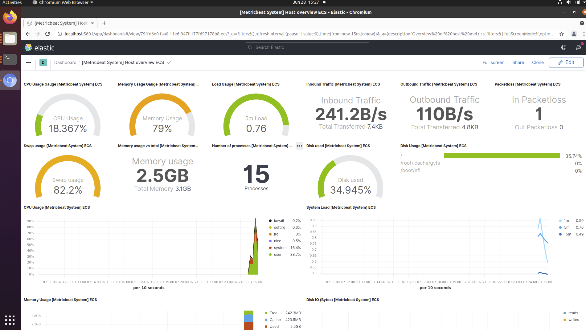
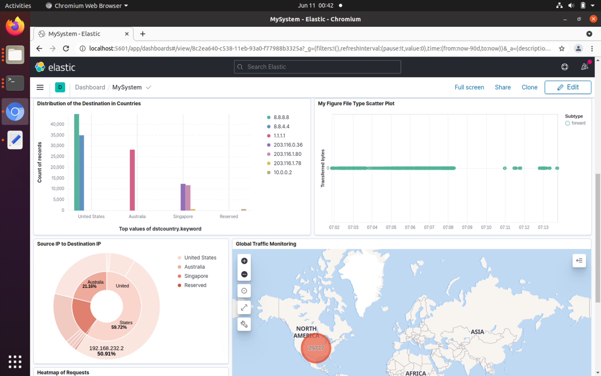

```

```

# ELK_SIEM

SIEM is a system that collects information from the private network, analyzes 
and detects malicious behaviors, and shows the records and results to the user 
and manager.

"ELK" is the acronym for three open source projects: Elasticsearch, Logstash, 
and Kibana. Elasticsearch is a search and analytics engine. Logstash is 
a server‑side data processing pipeline that ingests data from multiple sources 
simultaneously, transforms it, and then sends it to a "stash" like 
Elasticsearch. Kibana lets users visualize data with charts and graphs in 
Elasticsearch.

## Pre-requisites

This tools are installed and tested in these following environment:

- Ubuntu OS 20.04
- Docker Container
- ...

## Installation Steps

### Clone Repositories

```shell script
git clone https://github.com/YuxiLing/ELK_SIEM
```

### Run Docker

```shell script
cd <elasticsearch\kibana\logstash>
docker run ...
```

### Check the status
```shell script
docker ps -a
```

### Check the Kibana UI

```
https://localhost:5601
```
## Setup the Log Resource

Go to the Home Page, open the left side menu.

Go to Management -> Stack Management -> Data -> Index Management.

Create a logstash indice from the template.

Then, enable the configuration of the logstash

```shell
cd <path of the logstash>
/bin/logstash -f logstash-filter.conf
```

Restart the service

```shell
system logstash start
```

Currently, the log data has been transferred into the ELK system.

## Customizing the Kibana UI for SIEM

### Uploading Kibana Dashboard

Visit https://localhost:5601, open the Kibana UI.

Open the left side menu, go to Management->Stack Management->Kibana->Saved Objects.

Click on the "import" button at the upper right corner.

Import the file ELK_SIEM/kibana/dashboard.ndjson. Set the name of the dashboard as you like.


### Check the View of the Dashboard

Go back to the Home page, open the left side menu.

Visit Analytics->Dashboard.

The dashboard should be found in the list.

Click on it, the dashboard will be loaded.





## Set up Security Detections

### Add roles

...

### Configure detection rules

...

### Connect rules with log data

...

